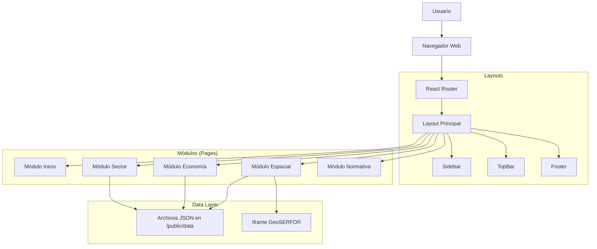

# Arquitectura Técnica del Observatorio PFC

Este documento describe la arquitectura de software, decisiones técnicas y flujo de datos del proyecto.
**Última actualización:** 2024-12-16

## 1. Visión General
La aplicación es una **Single Page Application (SPA)** construida con React, diseñada para ser desplegada estáticamente en GitHub Pages. Se prioriza la carga rápida, la interactividad y la modularidad.

## 2. Diagrama de Componentes (Alto Nivel)



## 3. Estructura de Directorios

```
MODULO_PFC/
├── public/
│   ├── data/
│   │   ├── economia/     # 4 archivos JSON
│   │   ├── espacial/     # 17 archivos JSON
│   │   └── sector/       # 7 archivos JSON
│   ├── docs/             # PDFs de normativa
│   ├── images/           # Logos e iconos
│   └── normativa/        # Documentos legales
├── src/
│   ├── components/       # Componentes reutilizables
│   ├── pages/
│   │   ├── inicio/       # 3 páginas
│   │   ├── sector/       # 16 páginas (8 implementadas)
│   │   ├── economia/     # 17 páginas (5 implementadas)
│   │   ├── espacial/     # 34+ páginas
│   │   └── normativa/    # 6 páginas
│   ├── App.tsx           # Router principal
│   └── main.tsx          # Entry point
├── docs/                 # Documentación del proyecto
└── scripts/              # Scripts de ETL Python
```

## 4. Decisiones Técnicas Clave

### 4.1 Gestión de Estado
- **Estado Local**: `useState` para interactividad simple (abrir/cerrar menús, tabs).
- **Estado de Navegación**: `react-router-dom` maneja la URL como fuente de verdad para la vista actual.
- **Data Fetching**: `useEffect` + `fetch()` para cargar JSON desde `/public/data`.

### 4.2 Estrategia de CSS
- **Tailwind CSS**: Genera solo el CSS utilizado al compilar.
- **Diseño System**: Colores institucionales definidos en `tailwind.config.js`.
- **Patrón Común**: Cards con `bg-white p-6 rounded-lg shadow-sm border`.

### 4.3 Visualización de Datos
- **Recharts**: Librería de gráficos composable basada en React.
  - Componentes: `BarChart`, `LineChart`, `PieChart`, `ComposedChart`
  - **Wrapper Pattern**: `<div className="min-h-0 relative overflow-hidden">` requerido para `ResponsiveContainer`.
- **Mapas**: Iframe para integrar visores existentes de GeoSERFOR.

### 4.4 Estructura de Datos JSON
Los datos residen en `public/data/` como archivos JSON estáticos.

**Patrón estándar**:
```json
{
  "kpi": { ... },
  "metadata": { "title": "...", "lastUpdated": "..." },
  "regions": [ ... ],
  "charts": { ... }
}
```

## 5. Despliegue (CI/CD)
El flujo de despliegue se maneja mediante **GitHub Actions**:
1.  **Trigger**: Push a rama `main`.
2.  **Build**: `npm run build` genera los archivos estáticos en `dist/`.
3.  **Deploy**: Sube la carpeta `dist/` a la rama `gh-pages`.

## 6. Dependencias Principales

| Paquete | Versión | Uso |
|---------|---------|-----|
| react | ^18.x | Framework UI |
| react-router-dom | ^6.x | Enrutamiento SPA |
| recharts | ^2.x | Gráficos |
| lucide-react | ^0.x | Iconografía |
| tailwindcss | ^3.x | Estilos |
