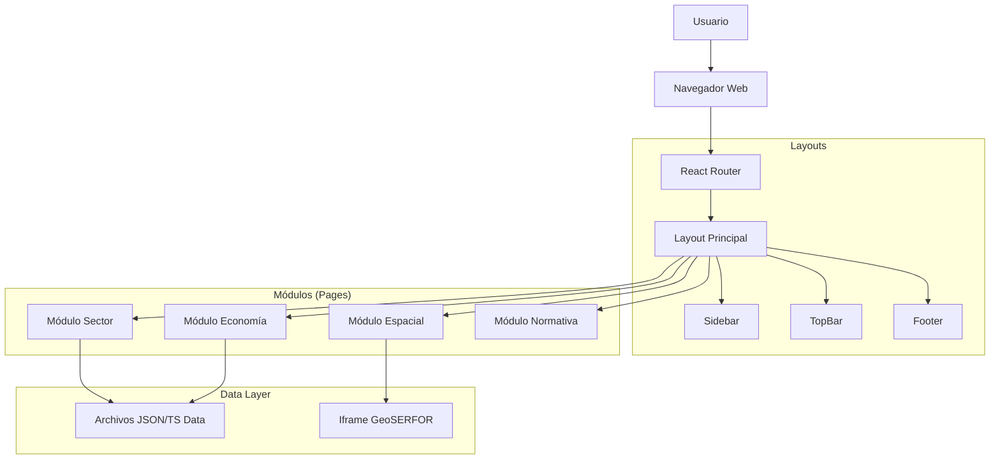

# Arquitectura Técnica del Observatorio PFC

Este documento describe la arquitectura de software, decisiones técnicas y flujo de datos del proyecto.

## 1. Visión General
La aplicación es una **Single Page Application (SPA)** construida con React, diseñada para ser desplegada estáticamente (Static Site Generation/Client-side Rendering) en entornos como GitHub Pages o AWS S3. Se prioriza la carga rápida, la interactividad y la modularidad.

## 2. Diagrama de Componentes (Alto Nivel)

## 3. Decisiones Técnicas Clave

### 3.1 Gestión de Estado
- **Estado Local**: `useState` para interactividad simple (abrir/cerrar menús, tabs).
- **Estado de Navegación**: `react-router-dom` maneja la URL como fuente de verdad para la vista actual.
- **Context API** (Futuro): Para temas (Dark Mode) o sesión de usuario, se usará Contexto nativo de React para evitar la complejidad de Redux.

### 3.2 Estrategia de CSS
- **Tailwind CSS**: Se eligió por:
  - **Performance**: Genera solo el CSS utilizado al compilar.
  - **Mantenibilidad**: Evita conflictos de nombres de clases y css global "spaghetti".
  - **Diseño System**: Facilita mantener la consistencia visual (colores, espacios) mediante config centralizada.

### 3.3 Visualización de Datos
- **Recharts**: Librería de gráficos composable basada en React.
  - *Por qué*: Es declarativa, ligera y construida sobre SVG, lo que garantiza nitidez en cualquier pantalla.
- **Mapas**:
  - Fase actual: Iframe para integrar visores existentes de GeoSERFOR.
  - Fase futura: Leaflet/MapLibre GL JS para mapas nativos interactivos si se requiere personalización avanzada.

## 4. Estructura de Datos
Actualmente, los datos residen en `src/data` como archivos TypeScript estáticos (`.ts`) que exportan arrays de objetos.
**Patrón de Migración futura**: Estos archivos se reemplazarán por llamadas `fetch()` a una API REST/GraphQL sin cambiar la interfaz de los componentes, gracias a que los tipos están definidos en `src/types`.

## 5. despliegue (CI/CD)
El flujo de despliegue se maneja mediante **GitHub Actions**:
1.  **Trigger**: Push a rama `main`.
2.  **Build**: `npm run build` genera los archivos estáticos en `dist/`.
3.  **Deploy**: Sube la carpeta `dist/` a la rama `gh-pages`.
